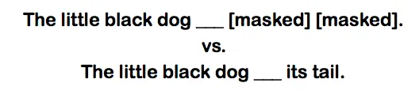
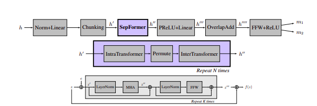

# Audio Transformer

The transformer consist of encoder and decoder. The encoder recives an input, in this case NLP the sequence text of token are passed as input in the encoder.But in case of the audio signal, sequence of the audio chunk is tokenized and passed to the encoder. The enceder model is trained to acquire understanding from the input.

The decoder uses the encoder's representation along with other inputs to generate a target sequence. This part of model is tarined to generate output.

The key features in case of transformer model is the attention layer.

We can pass the input to the encoder as the signal in time domain or the spectrogarm of the signal or the text according to the requirement. And similarly generate output in time, spectrogram or text according to need.

Models such as Wav2Vec2 and HuBERT can be used for raw waveform as input.
If the audio duration is too long the raw waveform is not compactible. So we can use spectorgram as input.

**Attention**

**Multi-Head Self-Attention**

What’s new with the Transformer is not really its encoder-decoder architecture but that it does away with traditionally used recurrent layers. Instead, it entirely relies on self-attention.

So what is self-attention? In short, it is the model’s way to make sense of the input it receives.

One of the problems of recurrent models is that long-range dependencies (within a sequence or across several sequences) are often lost. That is, if a word at the beginning of a sequence carries importance for a word at the end of a sequence, the model might have forgotten the first word once it reaches the last word. Not really that smart those RNNs, are they? ;-) Transformer models use a different strategy to memorize the whole sequence: self-attention!

Long-term dependencies in a sequence: if the model does not remember “boy” from the beginning, it might not know which pronoun to use at the end. Him, her, it? (Image by author)
In the self-attention layer, an input x (represented as a vector) is turned into a vector z via three representational vectors of the input: q(ueries), k(eys) and v(alues). These are used to calculate a score that shows how much attention that particular input should pay to other elements in the given sequence.

What I have just vaguely expressed in words can be defined by the following formula much more precisely:

Since formulae are not always very intuitive, a step-by-step visualization of the calculation should make things a little clearer.

Say we want to calculate self-attention for the word “fluffy” in the sequence “fluffy pancakes”. First, we take the input vector x1 (representing the word “fluffy”) and multiply it with three different weight matrices Wq, Wk and Wv (which are continually updated during training) in order to get three different vectors: q1, k1 and v1. The exact same is done for the input vector x2 (representing the word “pancakes”). We now have a query, key and value vector for both words.

The query is the representation for the word we want to calculate self-attention for. So since we want to get the self-attention for “fluffy”, we only consider its query, not the one of “pancakes”. As soon as we are finished calculating the self-attention for “fluffy”, we can also discard its query vector.

The key is a representation of each word in the sequence and is used to match against the query of the word for which we currently want to calculate self-attention.

The value is the actual representation of each word in a sequence, the representation we really care about. Multiplying the query and key gives us a score that tells us how much weight each value (and thus, its corresponding word) obtains in the self-attention vector. Note that the the value is not directly multiplied with the score, but first the scores are divided by the square root of the dk, the dimension of the key vector, and softmax is applied.

The result of these calculations are one vector for each word. As a final step, these two vectors are summed up, and voilà, we have the self-attention for the word “fluffy”.

Self-attention for the word “his”. The lines indicate how much attention the word “his” pays to other words in the sequence. (Image by author)
You may have noticed that it’s called multi-head self-attention. This is because the process above is carried out multiple times with different weight matrices, which means we end up with multiple vectors (called heads in the formulae below). These heads are then concatenated and multiplied with a weight matrix Wo. This means that each head learns different information about a given sequence and that this knowledge is combined at the end.

So far, I haven’t mentioned the most important thing: all these calculations can be parallelized. Why is this a big deal? Let’s look at RNNs first. They need to process sequential data in order, i.e. each word of a sequence is passed to the model one by one, one after the other. Transformer models, however, can process all inputs at once. And this makes these models incredibly fast, allowing them to be trained with huge amounts of data. You now wonder how the Transformer knows the correct order of a sentence if it receives it all at once? I’ll explain that in the section about Positional Encodings below.

As we saw in very first picture showing the Transformer architecture, self-attention layers are integrated in both the encoder and decoder. Which just had a look at what self-attention looks like in the encoder. The decoder, however, uses what is called masked multi-head self-attention. This means that some positions in the decoder input are masked and thus ignored by the self-attention layer. Why do they get masked? When predicting the next word of a sentence, the decoder should not know which word comes after the predicted word. Instead, only words up until the current positions should be known to the decoder. After all, when actually using the model to get real next-word predictions, the decoder cannot see future positions either. So by masking them during training, we don’t allow the decoder to cheat.

In the first sentence (masked), the next word is far more difficult to predict than in the second sentence (unmasked). The words “its tail” make it clear the word to predict is probably “wiggled”. (Image by author)
One crucial aspect of the model is still missing. How does information flow from the encoder to the decoder? This is what the the encoder-decoder self-attention layer is here for. This layer works very similarly to the self-attention layer in the encoder. However, the query vector comes from the previous masked self-attention layer, the key and value vector come from the output of the top-most encoder. This allows the decoder to take into account all positions in the input sequence of the encoder.

# SepFormer

SepFormer, a novel RNN-free Transformer-based neural network for speech separation. The SepFormer learns short and long-term dependencies with a multi-scale approach that employs transformers. The proposed model achieves state-of-the-art (SOTA) performance on the standard WSJ0-2/3mix datasets. It reaches an SI-SNRi of 22.3 dB on WSJ0-2mix and an SI-SNRi of 19.5 dB on WSJ0-3mix. The SepFormer inherits the parallelization advantages of Transformers and achieves a competitive performance even when downsampling the encoded representation by a factor of 8. It is thus significantly faster and it is less memory-demanding than the latest speech separation systems with comparable performance.

The high-level description of the system: The encoder block
estimates a learned-representation for the input signal, while the
masking network estimates optimal masks to separate the sources
present in the mixtures. The decoder finally reconstructs the estimated sources in the time domain using the masks provided by the
masking network.

## Encoder

The encoder takes in the time-domain mixture-signal x ∈ RT as input, which contains audio from multiple speakers. It learns an STFT-like representation h ∈ R F ×T 0 using a single convolutional layer:

h = ReLU(conv1d(x)).

## Masking Network

(Top) The overall architecture proposed for the masking network. (Middle) The SepFormer Block.(Bottom) The transformer architecture f(.) that is used both in the IntraTransformer block and in the InterTransformer block.

## Decoder
The decoder simply uses a transposed convolution layer, with the same stride and kernel size of the encoder. The input to the decoder is the element-wise multiplication between the mask mk of the source k and the output of the encoder h. The transformation of the decoder can therefore be expressed as follows:

s^k = conv1d-transpose(mk ∗ h)

where s^k ∈ RT denotes the separated source k.

# Spleeter
Spleeter is a model that is used in seperation of music source seperatioin. It helps in Music Information Retrival(MIR) for source seperation such as vocal lyrics analysis from audio, music transription, singer identicication or vocal melody extraction.

## Spleeter details
It contain models for:
- vocal seperation
- 4 steam seperation (vocal, bass, drum and others)
- 5 steam seperation (vocal, bass, drum, piano and others)

The pre-trained models are U-nets. The U-net is a encoder/decoder Convolutional Neural Network (CNN) architecture with skip connections. We used 12-layer U-nets (6 layers for the encoder and 6 for the decoder). A U-net is used for estimating a soft mask for each source (stem).Training loss is a L1-norm between masked input mix spectrograms and source target spectrograms. The models were trained on Deezer internal datasets using Adam. Separation is then done from estimated source spectrograms using soft masking or multi-channel Wiener filtering.
