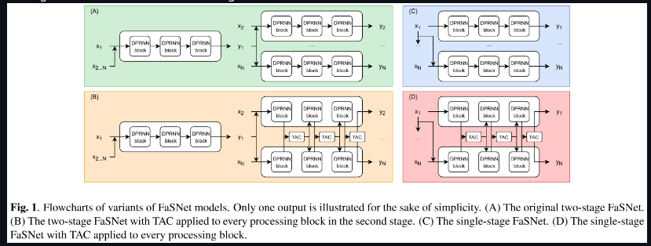
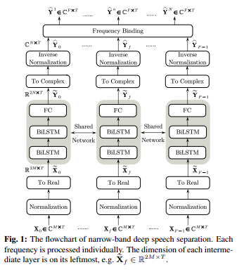
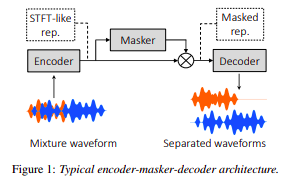

# Multi Channel Source Seperation

Multi-channel source separation, is a technique used in signal processing to separate a set of mixed signals into their original source components. This is done without any prior knowledge about the sources or the mixing process.

Imagine a scenario where multiple audio sources (like voices or instruments) are recorded using multiple microphones. The signals captured by these microphones are mixed together due to factors like room acoustics, microphone placement, and interference. Multi-channel source separation aims to recover the individual source signals from this mixture.

The steps we used for the seperation for multi channel source seperation are:
- FaSNET TAC
- NBSS
- Asteroid

## FaSNET TAC

Filter-and-sum network (FaSNet), a time-domain, filterbased beamforming approach suitable for low-latency scenarios. FaSNet has a two-stage system design that first learns frame-level time-domain adaptive beamforming filters for a selected reference channel, and then calculate the filters for all remaining channels.The filtered outputs at all channels are summed to generate the final output.

## NBSS

The STFT coefficient of multi-channel mixture signals are directly taken as the input feature of the network. For one TF bin, the STFT coefficients are concatenated along channels. Then, the time sequence of Xf,t for one frequency is taken as the input sequence of the RNN network:
To facilitate the network training, all input sequences are normalized to have the magnitude mean for the reference channel being one. As the network can only process real numbers, the complex-valued input sequence should be converted into real-valued sequence. This is done by simply replacing the complex number with its real part and imaginary part.

The outputs of the network are the separated signals for this frequency. In the literature, the magnitude spectra, TF mask or complex mask are often chosen as the training target.We follow and extend this principle in this work to the speech separation task, namely predicting the STFT coefficients of multiple speech signals.

## Asteroid
Asteroid is a Pytorch-based audio source separation toolkit that enables fast experimentation on common datasets. The toolkit was designed such that it can quickly be extended with new network architectures or new benchmark datasets. In the near future, pre-trained models will be made available and we intend to interface with ESPNet to enable end-to-end multi-speaker speech recognition.

# Reference
<a href="https://arxiv.org/pdf/1910.14104.pdf">FaSNet TAC</a>

<a href="https://arxiv.org/pdf/2005.04132.pdf">Asteroid</a>

<a href="https://arxiv.org/pdf/2110.05966.pdf">NBSS</a>
