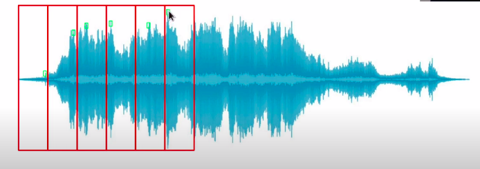

# Sound
## Audio Signal Processing

This project focuses on audio signal processing techniques for audio enhancement and upscaling. By employing various methods in the time and frequency domains, the project aims to improve the quality and characteristics of audio signals.

### Applications

The techniques explored in this project have applications in several areas, including:

1. **Audio Classification**: Audio signals often contain valuable information that can be used to classify different types of sounds. Techniques such as spectrogram analysis and feature extraction play a crucial role in creating effective audio classifiers.

2. **Audio Restoration and Enhancement**: Audio signals can deteriorate due to factors such as background noise, distortion, or low-quality recording equipment. This project explores methods to restore and enhance audio signals to achieve higher quality audio outputs.

3. **Music and Sound Production**: The project delves into techniques that are valuable in music and sound production. By manipulating audio signals in the frequency domain, producers can create unique effects, modify sounds, and apply filters.

### Content

The project covers a range of topics related to audio signal processing:

- **Sound Waves**: Understanding the fundamental nature of sound waves and how they're represented in digital form.

- **DAC/ADC**: Exploring the role of Digital-to-Analog Converters (DAC) and Analog-to-Digital Converters (ADC) in converting between analog and digital audio signals.

- **Time and Frequency Domain Analysis**: Discussing the significance of analyzing audio signals in both the time and frequency domains. Concepts like time-domain waveform and frequency-domain spectrograms are explored.

- **Audio Transformation Techniques**: Introducing various audio transformation techniques that contribute to audio enhancement. These include:

    - **Fourier Transform**: A crucial tool for converting audio signals from the time domain to the frequency domain, allowing us to analyze the underlying frequencies in the signal.

    - **Constant-Q Transform**: A modification of the Fourier Transform that provides a more logarithmic frequency scale, suitable for analyzing audio signals with different frequency resolutions.

    - **Mel Spectrograms**: Mel-frequency spectrograms help us understand how humans perceive different frequencies and contribute to tasks like audio classification and speech recognition.

    - **Chromograms**: These are used to visualize the tonal content of audio signals over time, making them useful for tasks related to music analysis and generation.

### Library
The most used library for audio processing is librosa
```bash
pip install librosa
```
### Learn to

- **Familiarize with Frequency/Time Domain Audio Features**: Understand the different aspects of audio signals in both the frequency and time domains. Learn about the significance of frequencies and time intervals in audio analysis.

- **Extract Features from Audio**: Dive into feature extraction techniques that allow you to capture meaningful information from audio signals. Explore techniques to identify key characteristics of audio data.

- **Recognize Audio Features in ML Applications**: Discover how to leverage audio features for machine learning tasks. Learn how to integrate extracted audio features into machine learning models for tasks such as classification and regression.

- **Preprocess Audio Data**: Understand the importance of preprocessing audio data before feeding it to machine learning models. Learn about noise reduction, normalization, and other techniques to enhance data quality.

- **Math for Audio Transform**: Get a grasp of the mathematical concepts behind audio transformations. Understand how techniques like Fourier Transforms and spectrogram analysis work and their significance in audio signal processing.

- **Librosa Use**: Master the `librosa` library, a powerful tool for audio analysis. Learn how to load audio files, extract features, perform transformations, and more using `librosa`.


## Introduction to Sound

Sound is produced by the vibration of matter, which causes air molecules to oscillate. This oscillation leads to changes in air pressure, which in turn creates a wave that travels through space. These waves are known as mechanical waves since they involve the propagation of oscillations through a medium.

Key Points about Sound:

- Sound is a form of mechanical wave that carries energy from one point to another.
- The oscillation of air molecules causes variations in air pressure, leading to the formation of sound waves.
- Sound waves travel through a medium, causing deformations in that medium, and can be described in terms of their frequency, amplitude, and other characteristics.


- **Waveform**: A waveform represents how a sound signal varies over time. It's described by parameters like amplitude, frequency, and phase. Common waveforms include sine waves, square waves, and triangle waves.

- **Frequency**: Frequency is the rate at which a sound wave oscillates. It's measured in Hertz (Hz) and is inversely proportional to the time period of the wave. Higher frequency sounds are perceived as higher-pitched.

- **Intensity**: Intensity refers to the energy carried by a sound wave. It's related to the amplitude of the wave. Sounds with larger amplitudes are perceived as louder.

- **Timbre**: Timbre is the unique quality that distinguishes one sound from another, even if they have the same pitch and loudness. It's determined by the harmonic content and envelope of the sound wave.

## Types of Sounds

Sounds can be classified into two main categories based on their waveform:

- **Periodic Sounds**: These sounds have a repeating pattern, either as a single sine wave or a combination of multiple sine waves. Periodic sounds include musical tones and harmonic sounds.

- **Aperiodic Sounds**: These sounds lack a repeating pattern and can be more complex. Aperiodic sounds include noise, like the hiss of static, and transient sounds like the striking of a drum.

## Anatomy of a Waveform

The waveform of a sound can be described by the formula:

y(t) = A * sin(2π * f * t + φ)

- `y(t)`: Instantaneous amplitude of the wave at time `t`.
- `A`: Amplitude of the wave (controls the height).
- `f`: Frequency of the wave (controls the pitch).
- `t`: Time.
- `φ`: Phase of the wave.

#### hearing range of human 20hz-20khz

## Pitch Perception

- **Pitch**: Pitch is how we perceive the frequency of a sound wave. It's closely related to the frequency of the wave but is perceived on a logarithmic scale. This means that doubling the frequency doesn't result in a doubling of perceived pitch.

- **Logarithmic Perception**: Our perception of pitch is logarithmic. This means that two frequencies are perceived as being similar if they differ by a power of 2. For example, if you double the frequency of a sound, it's perceived as being one octave higher.

## Musical Note System and MIDI

- **MIDI Notes**: The Musical Instrument Digital Interface (MIDI) note system assigns numerical values to musical notes. It provides a standard way to represent pitches and tones. The MIDI note number 69 corresponds to the frequency of A4 (440 Hz).

- **A3 and A4**: As an example, A3 corresponds to a frequency of 220 Hz. Moving up an octave to A4 (MIDI note 69) corresponds to 440 Hz. Similarly, A5 corresponds to 880 Hz.

## Pitch Perception and Mapping to Frequency

- **Mapping Pitch to Frequency**: Pitch and frequency are intertwined. The relationship between them can be described by the formula: `F(p) = 2^((p-69)/12) * 440`, where `p` is the MIDI note number. This formula maps MIDI note numbers to their corresponding frequencies. A4 (MIDI note 69) corresponds to 440 Hz.

- **Semitone and Cents**: In music, an octave is divided into 12 semitones. Each semitone corresponds to 100 cents. Cents are a unit of measurement for pitch difference. A noticeable pitch difference can be as small as 10-25 cents.

- **Octave and Cents**: An octave spans 1200 cents, which means it's divided into 12 equal parts, each containing 100 cents. This division allows us to measure and quantify pitch differences on a fine scale.

## Sound Power, Intensity, and Human Perception

- **Sound Power**: Sound power refers to the total energy radiated by a sound source. It's the rate at which energy is transferred through sound waves. It's typically measured in watts (W).

- **Sound Intensity**: Sound intensity is the amount of sound power per unit area. It quantifies how much energy is passing through a given area. Sound intensity is an important parameter for understanding the strength of sound waves.

- **Threshold of Hearing (TOH)**: Human hearing is incredibly sensitive. The threshold of hearing represents the minimum sound intensity that a human can perceive. It's an astonishingly small value, approximately 10^-12 watts per square meter (W/m^2).

- **Threshold of Pain (TOP)**: On the other end of the spectrum, the threshold of pain is the sound intensity level beyond which sound becomes painful or damaging to the human ears. It's around 10 watts per square meter (W/m^2).


## Sound Intensity, Loudness, and Timbre

- **Intensity Level**: Sound intensity refers to the amount of energy carried by a sound wave per unit area. Intensity levels are often measured in decibels (dB), a logarithmic scale that compares the intensity to a reference level, often the threshold of hearing (TOH). The formula for intensity level is `dB(I) = 10 * log(I/I(TOH))`. An intensity level of 0 dB corresponds to the reference intensity.

- **Loudness**: Loudness is a subjective perception of sound intensity. It's influenced by factors such as the duration, frequency, and age of the listener. Loudness is measured in phons and provides insight into how we perceive the strength of a sound.

- **Timbre**: Timbre is the unique color or quality of a sound that distinguishes it from others with the same pitch and loudness. It's described using words like bright, dark, dull, and warm. Timbre depends on factors like the sound envelope, harmonic content, and amplitude/frequency modulation.

## Features of Timbre

- **Multidimensional Nature**: Timbre is complex and multidimensional. Different aspects contribute to the overall timbral perception of a sound.

- **Sound Envelope**: The sound envelope describes how the amplitude of a sound wave changes over time. It includes stages like attack, decay, sustain, and release, which influence timbre.

- **Harmonic Content**: The harmonic content refers to the presence and strength of harmonics (whole-number multiples of the fundamental frequency) in a sound. Harmonics contribute to timbre.

- **Amplitude/Frequency Modulation**: Modulation involves varying the amplitude or frequency of a carrier wave with a modulating signal. Modulation techniques influence the timbre of a sound.


## Sound Envelope, Complex Sounds, and Partials

- **Sound Envelope**: The sound envelope describes how the amplitude of a sound wave changes over time. It's commonly represented as Attack-Decay-Sustain-Release (ADSR), where Attack is the initial rise in amplitude, Decay is the decrease, Sustain is the constant amplitude, and Release is the decrease after the key is released. The sound envelope influences the timbre and character of a sound.

- **Complex Sounds and Partials**: Complex sounds are often a superposition of multiple sinusoids, each with its own frequency, amplitude, and phase. These sinusoids are called partials, and they are used to describe the structure of a complex sound. The lowest partial is the fundamental frequency, while harmonic partials are frequencies that are integer multiples of the fundamental frequency.

- **Harmonics and Inharmonicity**: Harmonic partials are integral multiples of the fundamental frequency (e.g., 2x, 3x, etc.). Inharmonicity occurs when partials deviate from this harmonic structure. For example, if the partials are not integer multiples, they are considered inharmonic, resulting in a unique timbre.

## Frequency Modulation and Vibrato

- **Frequency Modulation (Vibrato)**: Frequency modulation involves periodic variations in the frequency of a sound signal. This effect, also known as vibrato, introduces a wobbling or fluctuation in pitch. Vibrato is often used to add expressiveness to musical performances and can be achieved through various modulation techniques.


## Understanding Audio Signals: Analog and Digital

- **Analog Signal**: An analog signal is continuous and can take on any value within a range. It's used to represent real-world phenomena without discretization.

- **Digital Signal**: A digital signal is a sequence of discrete values, often represented as binary digits (bits). It's a result of discretizing analog signals.

## Analog-to-Digital Conversion: Sampling and Quantization

- **Sampling**: Analog signals are converted to digital signals through two main processes. The first is sampling, where the continuous analog signal is sampled at specific points in time to obtain discrete values.

- **Quantization**: After sampling, each sampled value is quantized, which involves mapping it to a discrete set of values. The resolution of quantization is determined by the number of bits used for representation.

- **Pulse-Code Modulation**: In audio, this conversion process is known as Pulse-Code Modulation (PCM), where continuous audio signals are converted into a digital representation.

## Sample Rate, Nyquist Frequency, and Quantization Resolution

- **Sample Rate**: The sample rate (sr) determines how often the analog signal is sampled. Higher sample rates lead to less sampling error, while lower sample rates result in higher errors.

- **Nyquist Frequency**: The Nyquist frequency (f) is the highest frequency that can be accurately represented by a given sample rate (sr). The Nyquist theorem states that the sample rate should be at least twice the highest frequency in the signal: `sr >= 2f`.

- **Quantization Resolution**: The quantization process involves mapping continuous amplitude values to discrete values (usually in bits). The bit depth, or quantization resolution, determines the granularity of this mapping.

## Dynamic Range and Signal-to-Quantization Noise Ratio (SQNR)

- **Dynamic Range**: The dynamic range is the difference between the largest and smallest signals that a system can record. Higher resolution leads to a wider dynamic range.

- **Signal-to-Quantization Noise Ratio (SQNR)**: SQNR represents the relationship between the maximum signal strength and quantization error. It correlates with the dynamic range and is often measured in decibels (dB). For example, SQNR with 16 bits can be around 96 dB.

## Recording Sound: From Source to Computer

The process of recording sound involves several steps:

1. **Source**: The sound originates from a source, such as a musical instrument or voice.

2. **Analog-to-Digital Conversion (ADC)**: The analog sound wave is converted to a digital signal through sampling and quantization.

3. **Computer**: The digital signal is then processed and stored by a computer or other digital devices.


## Extracting Audio Features for Intelligent Systems

- **Audio Features**: Audio features are essential descriptors of sound that capture various aspects of the signal. Different features provide insights into different characteristics of the sound, enabling us to build intelligent audio systems.

- **Categorization of Audio Features**: Audio features can be categorized based on various criteria, including:
  - **Level of Abstraction**: High, mid, and low-level features. High-level features capture aspects like instrumentation, key, melody, and genre. Mid-level features include pitch and beat. Low-level features are typically used by machines, not humans.
  - **Temporal Scope**: Features can be instantaneously computed, or they might consider larger segments or even the entire sound.
  - **Music Aspect**: Features can capture elements like beat, timbre, pitch, and harmony.
  - **Signal Domain**: Features can be computed in the time domain, frequency domain, or time-frequency representation.

- **Machine Learning Approach**: Building intelligent audio systems involves leveraging different machine learning approaches:
  - **Traditional Machine Learning**: This approach involves manually engineering features like amplitude envelope, zero crossing rate, spectral centroid, etc., and then using traditional machine learning algorithms for tasks like prediction.
  - **Deep Learning**: With deep learning, features can be automatically extracted through neural networks, which can capture intricate patterns in the data.

## Types of Intelligent Audio Systems

- **Digital Signal Processing (DSP)**: Rule-based systems often used in audio processing applications.
- **Traditional Audio Systems**: These involve feature engineering where hand-crafted features are used for analysis and prediction.
- **Deep Learning Audio Systems**: These leverage automatic feature extraction through deep neural networks, providing a higher level of abstraction.

Audio Processing in Ml
Time-domain features
frequecnty domain freatruse
time-frequency domain featured

Time domain features
source ==> ADC ==> framing ==> feature computation ==> aggregration(mean, median, Gaussian Mixture Modle)==> feature value/vector/matrix

Frames
percivable audio chunks
 1 sample @ 44.1kHz = .0227ms
 duration 1 sample<< Ear's time resolution 10ms
 power of 2 num. samples increases speed
 typical value: 256-8192

 df = 1/sr .K
 K -> frame size
 df -> duration of frame


 Frequency-domain feature pipeline
 source ==> ADC ==> frame ==> windowing ==> forier transform ==> feature computation ==> aggregartion ==> feature value/vector/matrix

Spectral leakage
processed signal isn't an integer number of periods
endpoints are discontiuous
discontiuities appears as high-frequency components not present in the original signal

windowing
apply windowing function to each frame
elimainates samples at both ends of a frame
generates a periodic signal

Hann window
w(k) = 0.5 (1-cos((2pik)/K-1)), k = 1...K

sw(k) = s(k)*w(k), k = 1,..K

overlaping frame helps endpoints to contribute in the signal


Time-domain audio featrues
Amplitude envelop(AE)
Root-mean-square energy (RMS)
Zero-crossing rate(ZCR)

Amplitude envelope
max amplitude value of all samples in a frame
give rough idea of loudness
sensitive to outliers



AEt = max((t+1)(k-1))(k=t.K) s(k)

use
onset detection(identify notes), music genre classification

Root-mean-square energy
rms of all samples in a frame
indicator of loudness
less sensitive to outliers than AE


use
audio segmentation, music genre classification

Zero crossing rate
number of times a signal crosses the horizontal axis


use
recognition of percussive vs pitch sounds
monophonic pitch estimation
voice/unvoiced decision for speech signals


Fourier Transform
decompoer complex sound into freaquency domain
time ==> frequency
compare signal with sinusods of various frequency
for each frequency we get magnitude and phase
high maginitude indicates high similarity between the signal and a sinusoid


# Reference
<a href='https://github.com/musikalkemist/AudioSignalProcessingForML/tree/master/1-%20Overview'>AudioSignalProcessingForML</a><br>
<a href='https://www.youtube.com/watch?v=iCwMQJnKk2c&list=PL-wATfeyAMNqIee7cH3q1bh4QJFAaeNv0'>Audio Signal Processing for Machine Learning</a>
